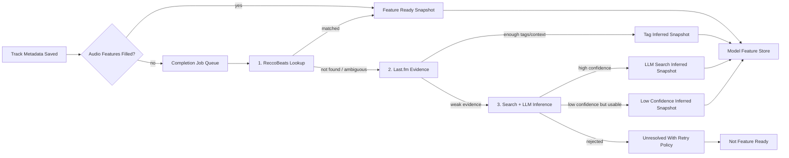
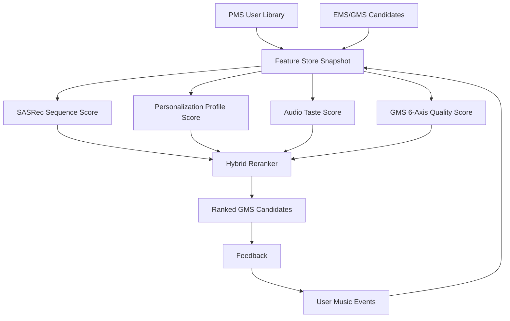

# Audio Feature Completion and Hybrid Personalization Plan

작성일: `2026-05-20`

## 1. 목적

이 문서는 `my-forever-music`의 개인화 추천 정확도를 높이기 위해, 비어 있는 오디오 특성을 가능한 모든 실제/추론 수단으로 채우고, 새 `Audio Taste Model`을 기존 개인화 모델과 하이브리드로 적용하는 계획을 정의합니다.

핵심 결정은 아래와 같습니다.

- 기존 트랙의 비어 있는 오디오 특성은 backfill job으로 계속 보강한다.
- 새로 들어오는 PMS/EMS/GMS 트랙은 오디오 특성이 비어 있으면 즉시 completion pipeline에 넣는다.
- 추천/학습에 쓰이는 feature snapshot은 `measured`, `provider_lookup`, `tag_inferred`, `llm_search_inferred`를 구분한다.
- 추론값은 가짜 측정값처럼 저장하지 않고, confidence와 evidence를 남긴 뒤 모델에서 낮은 가중치로 사용한다.
- 새 모델은 사용자의 오디오 취향 벡터를 학습하고, 현재 `personalization profile`, `SASRec`, `GMS 6-axis evaluator`와 하이브리드로 결합한다.

관련 기준 문서:

- [AUDIO_FEATURE_PROVIDER_STRATEGY.md](AUDIO_FEATURE_PROVIDER_STRATEGY.md)
- [PMS_TRACK_AUDIO_FEATURE_STORAGE.md](../api/PMS_TRACK_AUDIO_FEATURE_STORAGE.md)
- [PERSONALIZED_RECOMMENDATION_MODEL_PLAN.md](PERSONALIZED_RECOMMENDATION_MODEL_PLAN.md)
- [RECOMMENDATION_LOOP_POLICY.md](RECOMMENDATION_LOOP_POLICY.md)

## 2. 문제 정의

현재 추천 루프는 아래 기반을 이미 갖고 있습니다.

- `PMS user library`
- `EMS collected pool`
- `GMS recommendation snapshot`
- `user_music_event`
- `user_personalization_profile`
- `SASRec MVP`
- `feature coverage / drift signal`
- `ReccoBeats` 기반 일부 오디오 특성 보강
- `Last.fm` scrobble/profile 기반 artist recurrence signal

하지만 오디오 특성 coverage가 낮으면 새 모델은 다음 한계를 가집니다.

- `danceability`, `energy`, `valence`, `acousticness`, `tempo` 같은 취향 축을 사용자별로 안정적으로 학습하기 어렵다.
- EMS/GMS 후보의 mood, tempo, energy 흐름 평가가 metadata 중심으로 치우친다.
- cold-start 또는 sparse interaction 사용자는 장르/아티스트 반복에 과도하게 의존하게 된다.
- 기존 트랙과 새 트랙의 feature 완전성이 다르면 모델 학습/서빙 데이터 분포가 어긋난다.

따라서 오디오 특성 completion은 단순 보강 작업이 아니라, 새 개인화 모델의 선행 조건입니다.

## 3. 원칙

### 3-1. Import와 feature-ready는 분리한다

트랙 metadata 저장과 오디오 특성 completion은 같은 성공 조건으로 묶지 않습니다.

- playlist import는 metadata를 먼저 저장한다.
- 오디오 특성이 비어 있으면 `audio_features_filled=false`로 저장하고 completion job을 enqueue한다.
- 단, 추천 모델 학습/서빙 snapshot에서는 `feature_ready=false`인 트랙을 별도 처리한다.
- 새 오디오 취향 모델은 완전한 수치가 없거나 confidence가 낮은 트랙을 그대로 같은 가중치로 학습하지 않는다.

즉, 사용자 import 경험은 막지 않지만, 모델 입력에서는 feature 완전성과 신뢰도를 엄격히 다룹니다.

### 3-2. 추론값은 측정값이 아니다

LLM과 검색으로 구한 값은 현실적인 fallback입니다. 하지만 이 값은 직접 측정한 오디오 분석값이 아니므로 아래 규칙을 지켜야 합니다.

- `audio_feature_source_class=llm_search_inferred`로 명확히 저장한다.
- `audio_feature_confidence`를 저장한다.
- 사용한 evidence URL, source 이름, tag, 요약, model version을 audit trail로 남긴다.
- ReccoBeats 같은 provider lookup 값이 이후에 들어오면 추론값보다 우선한다.
- 추론값으로 기존 측정/조회형 값을 덮어쓰지 않는다.

이 원칙은 기존의 `가짜 수치 생성 금지`를 완화하는 것이 아니라, 값의 provenance를 숨기지 않는 별도 계층을 추가하는 것입니다.

### 3-3. 모델은 결측 여부도 배운다

완성된 수치만 모델에 넣지 않습니다. 모델 입력에는 아래 신호도 함께 넣습니다.

- feature별 missing indicator
- feature source class
- feature confidence
- feature age
- evidence count
- measured/provider/inferred 여부

이렇게 해야 추론값이 많은 영역에서 모델이 과신하지 않고, coverage 자체를 품질 축으로 사용할 수 있습니다.

## 4. Completion Cascade

오디오 특성 completion은 아래 순서로 진행합니다.



### 4-1. 1순위: ReccoBeats

ReccoBeats는 현재 1차 오디오 특성 공급원입니다.

우선 lookup key:

1. Spotify track id
2. ReccoBeats track id
3. ISRC
4. title + artist + duration 후보 매칭

저장 source 예시:

- `reccobeats_lookup`
- `reccobeats_isrc_match`
- `reccobeats_title_artist_match`

ReccoBeats에서 채우는 핵심 필드:

- `acousticness`
- `danceability`
- `energy`
- `instrumentalness`
- `key`
- `liveness`
- `loudness`
- `mode`
- `speechiness`
- `tempo`
- `valence`

주의:

- ISRC lookup은 복수 후보가 나올 수 있으므로 title/artist/duration으로 다시 골라야 한다.
- `GET /v1/track/:id/audio-features`는 ReccoBeats 내부 track id 기준이다.
- rate limit에 걸리면 job을 실패로 끝내지 않고 retry-after 기반으로 지연 재시도한다.

### 4-2. 2순위: Last.fm

Last.fm은 직접적인 numeric audio feature API가 아닙니다. 따라서 `audio_*` 값을 그대로 가져오는 provider가 아니라, tag와 listening context 기반 inference evidence source로 사용합니다.

사용 가능한 신호:

- `track.getInfo`: track metadata, duration, listeners, playcount, top tags
- `track.getTopTags`: track-level tag와 count
- `artist.getTopTags`: artist-level tag
- `user.getRecentTracks`: 사용자 scrobble 시계열, loved 여부, 최근 반복 청취 맥락
- 기존 저장된 Last.fm scrobble snapshot: 사용자 장기/최근 affinity

Last.fm 기반 completion 규칙:

- numeric feature를 직접 제공한 것처럼 저장하지 않는다.
- tag map을 통해 rough bucket을 먼저 만든다.
- 예: `dance`, `electronic`, `club`은 danceability/energy 후보 evidence가 될 수 있지만 단독으로 확정하지 않는다.
- track-level tag가 artist-level tag보다 우선한다.
- 사용자 scrobble은 해당 사용자의 affinity signal이지, track 자체의 measured audio feature가 아니다.

저장 source 예시:

- `lastfm_track_tag_inferred`
- `lastfm_artist_tag_inferred`
- `lastfm_scrobble_context`

### 4-3. 3순위: Search + LLM Inference

ReccoBeats와 Last.fm만으로 채우지 못한 곡은 검색과 LLM을 사용해 추론합니다.

허용 evidence:

- 공식 artist/label/release page
- MusicBrainz/Discogs/Wikidata 같은 metadata source
- 신뢰 가능한 음악 매체/리뷰/인터뷰
- 공개 track page의 장르, 스타일, BPM, mood, instrumentation 설명
- Last.fm tag, provider genre, editorial description

LLM 역할:

- evidence를 요약한다.
- feature별 추정 범위를 제안한다.
- 추정 이유와 불확실성을 구조화한다.
- confidence가 높은 값은 feature snapshot으로 완성한다.
- confidence가 중간인 값은 완성 처리하지 않지만 evidence와 numeric estimate를 weak signal로 남긴다.
- confidence가 낮거나 evidence가 없으면 값을 저장하지 않고 unresolved로 남긴다.

LLM 출력은 반드시 구조화합니다.

```json
{
  "track_id": "pms-track-...",
  "source_class": "llm_search_inferred",
  "confidence": 0.72,
  "features": {
    "danceability": 0.68,
    "energy": 0.74,
    "valence": 0.56,
    "acousticness": 0.18,
    "instrumentalness": 0.04,
    "liveness": 0.12,
    "speechiness": 0.06,
    "tempo": 118.0
  },
  "evidence": [
    {
      "source": "Last.fm",
      "kind": "track_tag",
      "value": "synthpop"
    }
  ],
  "model_version": "audio-feature-inference-v1"
}
```

### 4-4. LLM/search confidence tier

LLM/search 결과는 단일 pass/fail이 아니라 아래 계층으로 처리합니다.

| Tier | Confidence | Snapshot | `audio_features_filled` | Job |
|---|---:|---|---|---|
| `accepted` | `>= 0.68` | 저장 | `true` | `completed` |
| `weak` | `0.50 <= confidence < 0.68` | 저장 | `false` | `unresolved` + `llm_search_low_confidence` |
| `rejected` | `< 0.50` 또는 evidence 없음 | 저장하지 않음 | 변경 없음 | `unresolved` + 사유 기록 |

이 정책의 핵심은 “모델 실험에 참고할 수 있는 weak signal”과 “사용자 트랙의 feature-ready 완료 상태”를 분리하는 것입니다. 따라서 downstream 모델은 numeric 값 존재 여부만 보지 않고, `audio_features_filled`, source, confidence, evidence count를 함께 사용해야 합니다.

초기 구현에서 `weak` tier는 기존 job status 범위 안에서 `unresolved`로 남깁니다. 이후 운영 화면에서 검토 큐가 필요해지면 `needs_review` 상태를 추가할 수 있습니다.

## 5. 데이터 모델 확장안

현재 `PMS`와 `EMS`는 provider-neutral `audio_*` 컬럼과 `audio_feature_source`, `audio_features_filled`를 갖고 있습니다. 여기에 아래 관리 필드를 추가합니다.

### 5-1. Track audio feature snapshot

권장 추가 필드:

| Field | Type | 의미 |
|---|---|---|
| `audio_feature_source_class` | text | `measured`, `provider_lookup`, `tag_inferred`, `llm_search_inferred`, `legacy_generated`, `unresolved`, `unknown` |
| `audio_feature_confidence` | numeric | 0.0-1.0 신뢰도 |
| `audio_feature_completed_at` | timestamp | completion pipeline이 현재 값을 확정한 시각 |
| `audio_feature_model_version` | text | LLM/tag inference rule version 또는 provider adapter version |
| `audio_feature_attempt_count` | integer | completion 시도 횟수 |
| `audio_feature_last_attempt_at` | timestamp | 마지막 시도 시각 |
| `audio_feature_next_retry_at` | timestamp | rate limit/실패 후 다음 재시도 시각 |
| `audio_feature_failure_reason` | text | 마지막 실패 원인 |

### 5-2. Evidence table

추론값은 별도 evidence table이 필요합니다.

```text
track_audio_feature_evidence
  id
  track_scope              -- pms_user_track / pms_track / ems_collected_track / canonical_track
  track_id
  source_name              -- reccobeats / lastfm / musicbrainz / discogs / web_search / llm
  source_url
  evidence_kind            -- audio_feature / tag / review / genre / bpm / model_output
  evidence_payload_json
  confidence
  collected_at
  expires_at
```

### 5-3. Completion job table

```text
audio_feature_completion_job
  id
  track_scope
  track_id
  user_id nullable
  priority
  status                  -- queued / running / completed / retry_wait / failed / unresolved
  requested_reason         -- pms_import / ems_collect / gms_save / stale_refresh / manual_retry
  attempt_count
  next_retry_at
  locked_at
  locked_by
  last_error
  created_at
  updated_at
```

Priority 기준:

1. 사용자의 PMS user library
2. GMS 저장/평가 후보
3. EMS high-confidence/high-usage candidate
4. EMS acquisition/search pool
5. cold catalog backfill

## 6. 새 모델: Audio Taste Model

새 모델의 1차 이름은 `AudioTasteVectorModel`로 둡니다.

목표:

- 사용자가 선호하는 오디오 특성 분포를 학습한다.
- 단순 장르/아티스트 반복이 놓치는 mood, tempo, density, 밝기, 에너지 취향을 잡는다.
- sparse user에서도 PMS playlist의 오디오 특성 평균/분산으로 빠르게 시작한다.
- SASRec sequence score와 GMS 6축 evaluator가 놓치는 acoustic similarity를 보강한다.

### 6-1. 입력 feature

Track feature:

- normalized audio features
- audio feature missing indicators
- source class one-hot
- confidence weight
- genre/tag embedding
- release year bucket
- source platform
- identity confidence

User feature:

- liked/saved/added/completed track의 weighted audio centroid
- skipped/rejected track의 negative centroid
- 최근 session centroid
- 장기 PMS library centroid
- novelty tolerance
- energy/tempo variance preference

Behavior label:

- `track_saved`
- `added_to_playlist`
- `play_completed`
- `repeat_played`
- `skipped_early`
- `recommendation_liked`
- `recommendation_rejected`
- `ignored_recommendation`

### 6-2. 모델 형태

초기 구현은 복잡한 deep model보다 설명 가능한 모델로 시작합니다.

1. `AudioCentroidBaseline`
   - 사용자 positive/negative centroid와 후보 feature의 거리 기반 점수
   - confidence가 낮은 feature는 낮은 weight
   - cold-start와 운영 디버깅에 좋음

2. `AudioTasteVectorModel`
   - user vector와 item audio/tag vector의 dot product
   - pairwise ranking loss 또는 weighted logistic loss
   - SASRec artifact와 별도 version으로 관리

3. `HybridReranker`
   - 기존 score와 새 audio taste score를 결합
   - inferred feature 비율이 높으면 audio taste 영향력을 자동 축소

### 6-3. Hybrid scoring



초기 scoring 초안:

```text
final_score =
  0.35 * sasrec_score
  + 0.20 * personalization_profile_score
  + 0.20 * audio_taste_score
  + 0.15 * gms_quality_score
  + 0.10 * novelty_diversity_score
```

운영 규칙:

- `audio_feature_confidence < 0.5`인 후보는 audio taste score 영향력을 낮춘다.
- `source_class=llm_search_inferred` 비율이 높은 playlist는 confidence axis에서 보수적으로 평가한다.
- SASRec artifact가 없으면 현재 profile/rule baseline + audio centroid baseline으로 fallback한다.
- audio model이 offline baseline보다 나쁘면 serving에 promote하지 않는다.

## 7. Feature Store Snapshot

모델은 원본 테이블을 직접 읽지 않고 snapshot을 사용합니다.

권장 dataset version:

- `audio-feature-completion-v1`
- `audio-taste-dataset-v1`
- `hybrid-personalization-v1`

Snapshot 필수 항목:

- track identity
- source platform/source space
- audio features
- source class/confidence
- evidence count
- identity confidence
- user event labels
- recommendation snapshot links
- dataset fingerprint
- generated_at

이 fingerprint는 SASRec artifact, AudioTaste artifact, recommendation audit log에 함께 남겨야 합니다.

## 8. 운영/관리 화면 요구

기존 `/recommendations/feature-coverage`는 아래 축으로 확장합니다.

- PMS audio feature coverage
- EMS audio feature coverage
- source class breakdown
  - measured/provider lookup
  - Last.fm/tag inferred
  - LLM/search inferred
  - legacy generated
  - unresolved
- confidence distribution
- stale feature count
- retry_wait count
- failed/unresolved top reasons
- provider별 API 실패율/rate limit 횟수

관리 action:

- selected track retry
- playlist-level backfill
- source-class별 재시도
- low-confidence inferred value review
- measured/provider value로 승격 시 evidence 확인

## 9. 구현 단계

### Phase 1. Coverage Audit

목표:

- PMS/EMS/GMS track의 현재 audio feature coverage를 정확히 집계한다.
- source string을 source class로 분류한다.
- stale/unresolved/unavailable 상태를 backfill 대상으로 만든다.

완료 기준:

- feature coverage admin에서 `source_class`와 confidence 없는 legacy row를 볼 수 있다.
- 기존 `audio_feature_source` 값이 migration 전에도 source class로 해석된다.

### Phase 2. Completion Queue + ReccoBeats Backfill

목표:

- 기존 트랙과 새 트랙을 completion job으로 enqueue한다.
- ReccoBeats lookup을 PMS/EMS 공통 provider adapter로 분리한다.

1차 구현 상태 (`2026-05-20`):

- `audio_feature_completion_job` 테이블과 local/JPA store를 추가했다.
- 관리자 전용 `POST /api/v1/recommendations/admin/audio-feature-completion/enqueue` endpoint가 PMS user library와 EMS collected pool의 누락 audio feature track을 멱등하게 queue에 넣는다.
- 관리자 전용 `GET /api/v1/recommendations/admin/audio-feature-completion/jobs` endpoint가 최근 job을 조회한다.
- PMS는 `pms_user_track + pms_import + priority 100`, EMS는 `ems_collected_track + ems_collect + priority 60`으로 시작한다.
- 관리자 전용 `POST /api/v1/recommendations/admin/audio-feature-completion/process` endpoint가 `queued` job을 claim하고 ReccoBeats lookup을 수행한다.
- PMS/EMS 성공 결과는 기존 provider-neutral audio feature snapshot에 `reccobeats_lookup` 또는 `reccobeats_isrc_match`로 저장한다.
- PMS playlist import 후 user library sync가 끝나면 incomplete PMS track을 자동 enqueue한다.
- EMS collected track 저장/갱신 직후 incomplete EMS track을 자동 enqueue한다.
- `AudioFeatureCompletionScheduler`를 추가해 queued/retry_wait job을 opt-in 주기로 처리할 수 있다. 기본 disabled이며 `AUDIO_FEATURES_COMPLETION_SCHEDULER_ENABLED=true`일 때 동작한다.
- `GET /api/v1/system/admin/schedules`의 `audio-feature-completion` 항목에서 scheduler 설정과 마지막 tick 상태를 확인할 수 있다.
- `GET /api/v1/recommendations/admin/feature-coverage` 응답에 최근 completion job 500개 기준 `audio_feature_completion.recent_job_count`, status count, unresolved/retry/failed top reason 분포를 함께 노출하고, `/recommendations/feature-coverage` 화면에 Audio Completion 패널과 status/reason table을 표시한다.
- confidence-aware 모델 feature store와 LLM/search worker는 다음 구현 조각으로 남긴다.

완료 기준:

- PMS import 후 비어 있는 트랙이 queue에 들어간다.
- EMS collection 후 비어 있는 트랙이 queue에 들어간다.
- ReccoBeats 성공 결과는 `provider_lookup` class와 confidence `0.9+`로 저장된다.

### Phase 3. Last.fm Evidence Mapper

목표:

- Last.fm track/artist tag와 scrobble context를 evidence로 저장한다.
- tag 기반 rough inference rule을 versioning한다.

완료 기준:

- Last.fm은 direct provider value가 아니라 `tag_inferred` evidence로만 저장된다.
- track tag가 충분한 경우 제한된 feature만 채운다.

1차 구현 상태 (`2026-05-20`):

- `track_audio_feature_evidence` 테이블과 local/JPA store를 추가했다.
- `LastFmWebApiClient`에 `track.getTopTags`, `artist.getTopTags` 조회 메서드를 추가했다.
- `LastFmAudioFeatureInferenceService`가 Last.fm track/artist tag를 `lastfm-tag-rules-v1` 규칙으로 rough audio feature snapshot으로 변환한다.
- 저장 source는 `lastfm_track_tag_inferred` 또는 `lastfm_artist_tag_inferred`, source class는 `tag_inferred`로 고정한다.
- `AUDIO_FEATURES_COMPLETION_LASTFM_MIN_CONFIDENCE`(기본 `0.55`) 미만이면 저장하지 않는다.
- ReccoBeats no-match job은 Last.fm inference를 한 번 시도한다. confidence gate를 통과하면 track row에는 partial audio feature snapshot을 저장하고 evidence table에는 tag/result evidence를 남긴다.
- Last.fm 추론은 측정값이 아니므로 `audio_features_filled=false`를 유지하며, completion job은 `unresolved` + `lastfm_tag_inferred_partial_audio_features`로 남겨 후속 LLM/search 단계가 이어받게 한다.
- feature coverage admin 응답의 `audio_feature_completion.top_reasons`에서 Last.fm partial inference와 provider 실패 reason 분포를 확인할 수 있다.

### Phase 4. Search + LLM Inference

목표:

- ReccoBeats/Last.fm 실패 트랙에 대해 검색 evidence를 모으고 LLM 추론값을 구조화한다.
- confidence gate 미달이면 unresolved로 유지한다.

완료 기준:

- LLM output은 JSON schema validation을 통과해야 저장된다.
- evidence 없는 LLM 추론은 저장하지 않는다.
- measured/provider lookup 값을 덮어쓰지 않는다.

1차 구현 상태 (`2026-05-20`):

- `services/ai`에 내부 `POST /v1/audio-features/infer` endpoint를 추가했다.
- 기본 모델은 `AI_AUDIO_FEATURE_INFERENCE_MODEL=gpt-5-mini`, confidence gate는 `AI_AUDIO_FEATURE_INFERENCE_MIN_CONFIDENCE=0.68`이다.
- AI service는 OpenAI Responses API `/responses`와 `web_search` tool을 사용하고, strict JSON schema output으로 `duration/key/mode/acousticness/danceability/energy/instrumentalness/liveness/loudness/speechiness/tempo/valence/evidence/rationale`을 받는다.
- evidence가 비어 있거나 confidence gate 미달이면 `status=low_confidence`로 반환하고 Spring worker는 저장하지 않는다.
- Spring API의 `AudioFeatureLlmSearchInferenceService`는 AI 응답이 `status=ok`일 때만 PMS/EMS audio feature snapshot을 `llm_search_inferred`로 저장하고, web evidence/result payload를 `track_audio_feature_evidence`에 남긴다.
- completion worker는 `ReccoBeats -> Last.fm -> LLM/search` 순서로 시도하며, LLM/search inference가 완전한 snapshot을 반환하면 job을 `completed`로 바꾼다.

### Phase 5. Audio Taste Dataset

목표:

- audio feature completion 결과를 user behavior dataset과 결합한다.
- confidence/missing/source class를 모델 feature로 포함한다.

완료 기준:

- Spring API가 `audio-taste-dataset-v1` snapshot을 export한다.
- AI service가 dataset validation report를 반환한다.

### Phase 6. AudioTaste Model + Hybrid Reranker

목표:

- `AudioCentroidBaseline`을 먼저 붙이고, 이후 `AudioTasteVectorModel`을 학습한다.
- GMS preview ranking에 hybrid score를 반영한다.

완료 기준:

- offline metric에서 기존 baseline 대비 개선 또는 무회귀가 확인된다.
- recommendation audit log에 `audio_model_version`, `hybrid_weights`, `audio_feature_dataset_fingerprint`가 남는다.

### Phase 7. Production Gate

목표:

- coverage, confidence, offline metric, product proxy metric을 기준으로 모델 promotion을 통제한다.

완료 기준:

- `audio_feature_coverage_ratio`가 threshold 미달이면 audio model 영향력을 자동 축소한다.
- inferred-only catalog에서는 confidence warning이 노출된다.
- rollback 시 이전 hybrid weights/model artifact로 되돌릴 수 있다.

## 10. Evaluation

Offline metric:

- `HitRate@K`
- `NDCG@K`
- `MRR@K`
- `Recall@K`
- `Coverage`
- `Novelty`
- `Diversity`
- audio feature calibration

Ablation:

- current baseline only
- SASRec only
- personalization profile only
- audio taste only
- SASRec + profile
- SASRec + profile + audio taste
- full hybrid

Product proxy:

- 추천 track 저장률
- 추천 playlist 저장률
- skip rate 감소
- play completion 증가
- repeat/playback dwell 증가
- GMS like/pass/save 참여율

Promotion rule:

- audio taste 추가가 최소 1개 핵심 metric을 개선해야 한다.
- 중요한 metric의 regression이 없어야 한다.
- 낮은 confidence feature가 많은 사용자군에서 별도 regression이 없어야 한다.

## 11. 리스크와 대응

| Risk | 대응 |
|---|---|
| 추론값이 틀려 추천이 흔들림 | source class, confidence, evidence, 낮은 weight, measured/provider 우선 |
| LLM hallucination | evidence 필수, JSON schema validation, confidence gate, audit review |
| Last.fm tag가 장르 편향을 만듦 | track tag 우선, artist tag는 낮은 weight, user scrobble은 item feature가 아니라 user signal로 분리 |
| ReccoBeats rate limit | cache, batch lookup, retry-after, priority queue |
| ISRC 중복/오매칭 | title/artist/duration scoring, ambiguity 상태 유지, confidence 낮으면 미저장 |
| feature coverage 낮음 | model missing indicator, fallback ranker, coverage dashboard |
| 추론값이 measured처럼 보임 | source class와 evidence를 API/UI/admin에 노출 |

## 12. 공식 참고

- ReccoBeats introduction: `https://reccobeats.com/docs/documentation/introduction`
- ReccoBeats get multiple audio features: `https://reccobeats.com/docs/apis/get-audio-features`
- ReccoBeats audio feature extraction: `https://reccobeats.com/docs/documentation/Analysis/audio-features-extraction`
- ReccoBeats rate limiting: `https://reccobeats.com/docs/documentation/rate-limiting`
- Last.fm `track.getInfo`: `https://www.last.fm/api/show/track.getInfo`
- Last.fm `track.getTopTags`: `https://www.last.fm/api/show/track.getTopTags`
- Last.fm `artist.getTopTags`: `https://www.last.fm/api/show/artist.getTopTags`
- Last.fm `user.getRecentTracks`: `https://www.last.fm/api/show/user.getRecentTracks`
