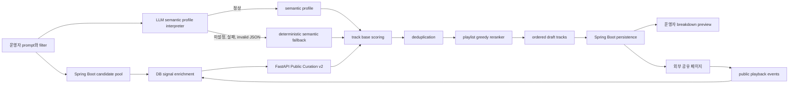

# Public Curation Model v2 설계

## 요약

Public Curation Model v1은 TIDAL에서 재생 가능한 외부 공유 플레이리스트를 빠르게 검증하기 위한 최소 결정론 모델이다. 실제 운영 화면에서 여러 트랙이 같은 점수를 받는 현상이 확인되었다.

v2는 기존 공개 큐레이션 도메인을 유지하면서 평가 품질을 높인다.

- LLM은 운영자 prompt를 실행당 한 번 해석해 semantic profile을 만든다.
- 트랙 평가는 DB에 있는 오디오 특성, metadata, 출처, 공개 재생 반응을 사용한다.
- 최종 선별은 playlist 전체를 보며 흐름, 다양성, 반복을 조정하는 reranker가 담당한다.
- LLM이 없거나 실패해도 deterministic semantic fallback으로 초안을 생성한다.
- 외부 공유 페이지에서는 내부 점수를 숨기고, 운영자 화면에서만 상세 breakdown을 보여준다.

LLM이 후보 트랙을 직접 선별하거나 곡마다 호출되는 구조는 사용하지 않는다. 재현성, 비용, 지연 시간, 장애 격리를 지키기 위해 LLM의 역할을 prompt 해석으로 제한한다.

## 현재 문제

현재 FastAPI scorer는 `public-curation-deterministic-v1`이다.

트랙 단위 점수는 아래 네 축만 사용한다.

- `theme_fit`
- `audio_fit`
- `tidal_readiness`
- `shareability`

점수 동률이 자주 발생하는 이유는 다음과 같다.

1. `theme_fit`은 prompt 본문을 해석하지 않는다. 운영자가 입력한 `mood_tags`, `genre_tags`와 후보의 tag, genre가 정확히 겹치는지만 본다.
2. Spring Boot 후보 추출은 `popularity`, `freshness`를 FastAPI에 전달하지 않는다. FastAPI는 두 값을 모두 기본값 `0.5`로 처리한다.
3. EMS 후보는 `primary_genre`가 없고 source platform tag만 전달되는 경우가 많다.
4. DB에는 더 많은 오디오 특성이 있지만 후보 계약은 일부만 전달한다.
5. 공개 재생 이벤트는 저장되지만 다음 큐레이션 생성에 반영되지 않는다.
6. 문서에 정의된 `coherence`, `diversity`, `redundancy`는 실제 scorer에 구현되지 않았다.
7. 공개 공유 페이지는 내부 점수를 그대로 표시한다. 방문자에게는 감상보다 모델 숫자가 먼저 보일 수 있다.

## 목표

### 제품 목표

- 같은 후보 풀에서도 prompt와 필터에 따라 점수와 순서가 의미 있게 달라진다.
- 동점이 발생하더라도 playlist reranker가 단조로운 artist, album, mood 반복을 줄인다.
- 실제 공개 재생 반응을 작은 보조 신호로 반영한다.
- LLM 장애가 큐레이션 생성 전체 장애로 이어지지 않는다.
- 운영자는 모델 경로와 breakdown을 확인할 수 있다.
- 외부 방문자는 내부 진단 숫자 없이 음악에 집중한다.

### 비목표

- 곡마다 LLM을 호출해 점수를 직접 받지 않는다.
- embedding 저장소와 vector DB를 이번 단계에 추가하지 않는다.
- 공개 재생 이벤트를 사용자 개인 PMS/GMS 학습 데이터와 섞지 않는다.
- 운영자가 곡을 수동으로 선별하는 CMS를 만들지 않는다.
- v2에서 온라인 학습 모델을 도입하지 않는다.

## 전체 구조



## LLM Semantic Profile

### 역할

LLM은 prompt를 실행당 한 번 구조화한다.

예시 prompt:

```text
비 오는 밤에 듣기 좋은 한국 인디와 재즈 감성.
너무 처지지 않고 카페에서 공유하기 좋은 30곡.
```

구조화 결과 예시:

```json
{
  "mood_tags": ["rainy", "night", "cafe", "warm"],
  "genre_tags": ["indie", "jazz"],
  "theme_keywords": ["비", "밤", "카페", "잔잔함", "도시"],
  "audio_targets": {
    "energy": { "target": 0.48, "importance": 0.9 },
    "valence": { "target": 0.42, "importance": 0.7 },
    "acousticness": { "target": 0.62, "importance": 0.8 },
    "danceability": { "target": 0.44, "importance": 0.4 },
    "tempo": { "target": 96.0, "importance": 0.4 }
  },
  "discovery_bias": 0.58,
  "energy_curve": {
    "intro": 0.38,
    "middle": 0.58,
    "outro": 0.42
  },
  "editorial_summary": "비 오는 밤의 카페에서 흐름을 깨지 않고 들을 수 있는 인디와 재즈 중심 구성"
}
```

### 호출 정책

- `AI_PUBLIC_CURATION_SEMANTIC_MODEL`을 사용한다.
- 값이 비어 있으면 `AI_EMS_ACQUISITION_MODEL`, 그다음 `AI_EMS_OVERVIEW_MODEL`을 순서대로 재사용할 수 있다.
- 기존 `AI_LLM_API_KEY`, `AI_LLM_BASE_URL`을 재사용한다.
- 호출은 큐레이션 실행당 최대 한 번이다.
- JSON schema로 응답 shape를 제한하고 Pydantic validation을 통과한 profile만 사용한다.
- LLM 응답은 트랙 목록을 포함하지 않는다.
- LLM은 존재하지 않는 곡, artist, provider 정보를 만들 수 없다.

### Fallback 정책

다음 상황에서는 생성 요청을 실패시키지 않는다.

- LLM model 미설정
- API key 미설정
- provider timeout 또는 HTTP 오류
- 빈 응답
- invalid JSON
- schema validation 실패

FastAPI는 운영자가 입력한 구조화 filter와 제한된 prompt keyword rule로 deterministic semantic profile을 만든다.

응답과 저장된 run summary에는 아래 값을 남긴다.

- `semantic_profile_status`: `llm` 또는 `semantic_fallback`
- `semantic_model`
- `semantic_warnings`

## Candidate Signal Enrichment

Spring Boot는 후보를 FastAPI에 보내기 전에 DB 신호를 보강한다.

### 공통 metadata

- title
- artist
- album
- ISRC
- TIDAL track id, URI, external URL
- image URL
- duration
- source scope
- source platform

### audio feature

사용 가능한 경우 아래 값을 전달한다.

- acousticness
- danceability
- energy
- instrumentalness
- liveness
- loudness
- speechiness
- tempo
- valence

오디오 특성 provenance와 confidence가 있으면 함께 전달한다.

- `audio_feature_source`
- `audio_feature_confidence`
- `audio_features_filled`

측정값과 inferred estimate를 같은 신뢰도로 취급하지 않는다. scorer는 confidence를 audio 점수 weight에 반영한다.

### PMS signal

- primary genre
- PMS source 여부
- audio feature recency

### EMS signal

EMS track이 포함된 playlist를 집계한다.

- playlist title
- playlist description
- curator
- collection source
- search query
- track이 발견된 playlist 수
- playlist 최대 follower 수
- 최근 수집 시각

playlist 문구는 keyword tag 후보로 사용한다.

후보 하나에 붙는 EMS 출처 신호는 아래 shape를 사용한다.

```json
{
  "source_playlist_signals": {
    "playlist_count": 4,
    "max_followers_count": 18420,
    "latest_collected_at": "2026-05-30T12:30:00Z",
    "titles": ["Late Night Jazz", "Rainy Cafe"],
    "descriptions": ["차분한 밤의 재즈", "비 오는 날의 카페 음악"],
    "curators": ["TIDAL"],
    "collection_sources": ["tidal_popular"],
    "search_queries": ["rainy jazz"]
  }
}
```

### 공개 재생 반응

기존 `public_playlist_play_event`와 `public_curation_playlist_track`을 TIDAL track id로 묶어 후보별 반응을 집계한다.

- play started 수
- play completed 수
- skipped 수
- play failed 수
- completion ratio
- skip ratio

샘플이 작은 곡이 과대 평가되지 않도록 Bayesian smoothing을 적용한다. 공개 반응은 보조 신호이며 최종 점수 영향은 제한한다.

후보 하나에 붙는 공개 반응 신호는 아래 shape를 사용한다.

```json
{
  "audience_response": {
    "play_started_count": 12,
    "play_completed_count": 8,
    "skipped_count": 2,
    "play_failed_count": 0,
    "completion_ratio": 0.6667,
    "skip_ratio": 0.1667
  }
}
```

## Track Base Scoring

TIDAL readiness는 공개 재생의 필수 조건이다. TIDAL-ready가 아닌 후보는 점수 계산 후 선택 대상에서 제외한다.

v2의 기본 점수 축은 다음과 같다.

| 축 | 의미 | 기본 weight |
| --- | --- | ---: |
| `semantic_theme_fit` | semantic profile, genre, mood, EMS playlist text와 후보 정렬도 | `0.26` |
| `audio_fit` | filter와 semantic audio target에 대한 거리 기반 적합도 | `0.24` |
| `metadata_quality` | ISRC, album, image, duration, genre, audio feature completeness | `0.10` |
| `source_quality` | PMS/EMS 출처 신뢰도, playlist follower, 발견 playlist 수 | `0.12` |
| `freshness` | 수집 시각과 audio feature recency 기반 발견 가치 | `0.10` |
| `audience_response` | Bayesian-smoothed 공개 완주, skip, 실패 반응 | `0.08` |
| `discovery_value` | 인기곡 편중을 줄이면서 새로운 곡을 남기는 값 | `0.10` |

합계는 `1.00`이다.

### 거리 기반 audio fit

v1처럼 범위 안에 들어오면 모두 `1.0`을 주지 않는다.

- 명시적 min/max filter가 있으면 범위 중앙과의 거리를 부드럽게 반영한다.
- semantic profile target이 있으면 target과의 정규화 거리를 반영한다.
- feature가 없으면 무조건 `0`으로 만들지 않고 coverage와 confidence를 낮춘다.
- tempo, loudness처럼 단위가 다른 feature는 정규화한 뒤 비교한다.

### 점수 precision

- 내부 계산은 충분한 precision을 유지한다.
- 저장은 기존 `numeric(8, 5)` 범위 안에서 처리한다.
- 운영자 화면은 소수점이 필요한 경우 breakdown에서 확인한다.
- 외부 공유 화면에는 점수를 노출하지 않는다.

## Playlist Greedy Reranker

base score 상위 곡만 자르면 비슷한 artist와 mood가 연속될 수 있다. v2는 최종 순서를 한 곡씩 선택한다.

### 순서 결정

1. 중복 identity를 제거한다.
   - ISRC
   - TIDAL track id
   - 정규화된 artist + title
2. 시작, 중반, 마무리 위치에 맞는 목표 energy를 계산한다.
3. 아직 선택하지 않은 후보에 placement adjustment를 계산한다.
4. 조정 점수가 가장 높은 후보를 다음 곡으로 선택한다.
5. 목표 곡 수를 채울 때까지 반복한다.

### placement adjustment

| 축 | 역할 |
| --- | --- |
| `coherence` | 직전 곡과 energy, valence, acousticness, tempo 차이가 너무 크지 않도록 조정 |
| `energy_curve_fit` | semantic profile의 intro, middle, outro 목표에 맞게 흐름 구성 |
| `diversity_bonus` | artist, genre, source playlist 분포가 한쪽으로 몰리지 않도록 보정 |
| `artist_repetition_penalty` | 같은 artist 반복과 가까운 위치 재등장을 감점 |
| `album_repetition_penalty` | 같은 album의 연속 또는 과다 포함을 감점 |
| `adjacent_similarity_penalty` | 거의 같은 audio vector가 연속되는 경우 감점 |

reranker는 base score를 무시하지 않는다. placement adjustment는 base score를 뒤집을 수 있지만 영향 범위를 제한한다.

### breakdown

최종 트랙에는 다음을 저장한다.

```json
{
  "base_score": 0.78124,
  "semantic_theme_fit": 0.83,
  "audio_fit": 0.74,
  "metadata_quality": 0.92,
  "source_quality": 0.68,
  "freshness": 0.71,
  "audience_response": 0.56,
  "discovery_value": 0.64,
  "placement_adjustment": 0.038,
  "coherence": 0.82,
  "energy_curve_fit": 0.77,
  "diversity_bonus": 0.04,
  "redundancy_penalty": 0.0,
  "final_score": 0.81924
}
```

## API 계약 변경

### FastAPI request

기존 `/v1/public-curations/score` 경로를 유지한다.

`candidate_tracks[]`에 아래 필드를 추가한다.

- `audio_feature_source`
- `audio_feature_confidence`
- `audio_features_filled`
- `metadata_tags`
- `source_playlist_signals`
- `audience_response`
- `freshness`

### FastAPI response

기존 응답 shape를 유지하면서 아래 실행 진단을 추가한다.

- `semantic_profile_status`
- `semantic_model`
- `semantic_profile`
- `semantic_warnings`

`model_version`은 `public-curation-hybrid-v2`로 바꾼다.

### Spring Boot admin response

운영자 초안 응답의 track에는 아래 정보를 추가한다.

- `score_breakdown`
- `reason`

운영자 실행 요약에는 아래 정보를 표시한다.

- model version
- semantic profile status
- semantic model
- semantic warning
- 평균 점수
- 후보 수
- TIDAL-ready 수
- 중복 제거 수

### 공개 share response

외부 공유 응답에서 내부 진단 필드를 제거한다.

- `score`
- `score_breakdown_json`
- `reason`

외부 페이지 track card에서도 점수를 제거한다.

### Fallback 경계

이번 단계의 `semantic_fallback`은 FastAPI process 안에서 LLM prompt 해석만 fallback 하는 기능이다.

- Spring Boot에서 FastAPI process 자체에 연결할 수 없는 경우는 기존처럼 생성 오류를 반환한다.
- FastAPI process는 살아 있지만 LLM model, API key, provider 응답에 문제가 있는 경우 deterministic semantic fallback으로 생성한다.
- FastAPI 전체 장애에 대한 Spring Boot local scorer 추가는 별도 작업으로 남긴다.

## 저장 구조

기존 테이블을 재사용한다.

- `public_curation_playlist.model_version`
- `public_curation_playlist_track.score`
- `public_curation_playlist_track.score_breakdown_json`
- `public_curation_playlist_track.reason`
- `public_curation_run.score_summary_json`
- `public_playlist_play_event`

이번 단계에서 신규 테이블은 추가하지 않는다.

## 오류 처리

| 상황 | 처리 |
| --- | --- |
| LLM 미설정 | deterministic semantic fallback으로 생성, run warning 저장 |
| LLM HTTP 오류 또는 timeout | deterministic semantic fallback으로 생성, run warning 저장 |
| LLM invalid JSON | deterministic semantic fallback으로 생성, run warning 저장 |
| 후보 없음 | 생성 실패 |
| TIDAL-ready 후보 부족 | 가능한 범위에서 초안 생성, warning 저장 |
| audio feature 부족 | metadata, source, freshness 신호로 평가하되 quality 감점 |
| 공개 반응 샘플 부족 | prior 중심 Bayesian-smoothed neutral score 사용 |

## 테스트 전략

### FastAPI

- semantic profile LLM 정상 응답을 사용한다.
- LLM 미설정 시 deterministic semantic fallback을 사용한다.
- LLM invalid JSON 시 semantic fallback을 사용하고 warning을 남긴다.
- 서로 다른 audio feature와 metadata를 가진 후보가 다른 점수를 받는다.
- 공개 반응이 좋은 후보는 제한된 audience boost를 받는다.
- 같은 artist가 연속되지 않도록 reranker가 순서를 조정한다.
- energy curve에 따라 intro, middle, outro 흐름이 달라진다.
- 중복 ISRC, TIDAL id, artist + title 후보를 제거한다.

### Spring Boot

- 후보 SQL이 확장 audio feature를 반환한다.
- EMS playlist signal을 집계한다.
- 공개 재생 반응을 TIDAL track id 기준으로 집계한다.
- FastAPI 확장 계약을 serialize, deserialize한다.
- score breakdown과 semantic summary를 기존 JSON 저장 필드에 보존한다.
- admin 응답은 breakdown을 노출한다.
- 공개 share 응답은 score, breakdown, reason을 노출하지 않는다.

### Frontend

- 운영자 화면은 selected track breakdown과 semantic fallback 여부를 보여준다.
- 외부 공유 페이지는 track score를 렌더링하지 않는다.
- 기존 공개 재생 흐름과 EQ player는 유지된다.

## 구현 순서

1. FastAPI v2 schema와 semantic profile interpreter.
2. deterministic semantic fallback과 LLM 경계 테스트.
3. track base scoring과 playlist reranker.
4. Spring Boot candidate signal enrichment.
5. Spring Boot AI client 확장과 JSON 저장.
6. 운영자 breakdown UI.
7. 외부 공유 응답과 UI에서 내부 점수 제거.
8. AI, Spring Boot, frontend regression verification.

## 후속 확장

v2 운영 데이터를 쌓은 뒤 아래를 검토한다.

- track metadata embedding cache
- prompt와 track embedding semantic similarity
- 공개 재생 반응 기반 offline metric
- A/B generation 비교
- 운영자 승인 또는 발행 결과를 반영한 ranking calibration
- playlist cover와 editorial copy를 위한 별도 생성 모델
